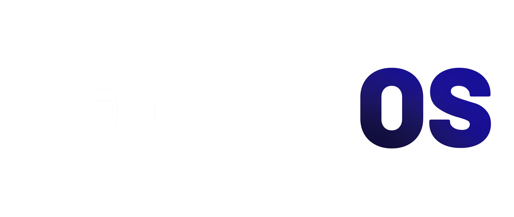

**NeoTuxOS** is a lightweight, bloat-free Linux distro based on Arch, made for everyday use.

## Built on Arch Linux™

NeoTuxOS runs on Arch Linux™ under the hood. Rolling release means your system is always current — no big version jumps, no reinstalls.

---

**NeoTuxOS** currently offers four desktop environment editions:

-  **Neodymium (GNOME)** – Clean interface, essential apps only, and Firefox. Nothing extra.
-  **Neohelium (XFCE)** – Fast and light, essential apps only, and Firefox. Works well on older hardware too.
-  **Neocobalt (Budgie)** – Simple layout, essential apps only, and Firefox. Nothing in the way.
-  **Neosilicium (KDE Plasma)** – Fully customizable desktop with KDE's own app suite. Not bloat-free by nature, but trimmed down as much as possible.

All editions run on the same Arch-based core. Different desktop, same system.

## These system builds are currently in development and not yet available.

---

# NeoTuxOS Terms and Conditions

Welcome to NeoTuxOS! By using, downloading, or distributing NeoTuxOS, you agree to the following terms:

## 1. License

NeoTuxOS is licensed under the **GNU General Public License v3 (GPLv3)**.  
You are free to use, modify, and redistribute the software under the terms of this license.

## 2. Usage

- NeoTuxOS is provided **as-is**. The developers are not responsible for any damage, data loss, or issues caused by using the software.  
- You may create derivative works or build your own distributions based on NeoTuxOS.  

## 3. Logos and Images

- All NeoTuxOS logos and images may be used for **personal purposes**, such as wallpapers or decorations.  
- You may not use any NeoTuxOS logos, images, or branding for **commercial purposes** without explicit permission.  
- You may modify logos for personal projects in a non-commercial context.

## 4. No Warranty

NeoTuxOS comes without any warranties. The developer make no guarantees about functionality, stability, or compatibility.  
Use at your own risk.

## 5. Intellectual Property

- The NeoTuxOS name and logos are owned by the creator (NeoTuxOS).  
- Referencing NeoTuxOS in non-commercial projects is allowed.  

## 6. Updates and Support

- NeoTuxOS may provide updates and new ISO releases.  
- Support is community-driven; no official technical support is guaranteed.

## 7. Changes to Terms

NeoTuxOS may update these Terms and Conditions. By continuing to use the software, you accept any changes.

---

# NeoTuxOS Privacy Policy

Your privacy is important to the developer of NeoTuxOS. This policy explains what information is collected and how it is used.

## 1. Information Collection

- NeoTuxOS **does not collect any personal data**.  
- Downloading ISOs or accessing the website does **not require registration or personal information**.

## 2. Third-Party Services

- NeoTuxOS may link to external services (e.g., GitHub, Netlify) for downloads or contributions.  
- The privacy policies of these services apply when you use them.

## 3. Your Rights

- Since no personal data is collected, there is nothing stored that you need to request deletion for.  

## 4. Changes to this Policy

- This Privacy Policy may be updated over time.  
- Continued use of NeoTuxOS or the website implies acceptance of any updates.

[NeoTuxOS Website](https://projectneo.netlify.app/)
